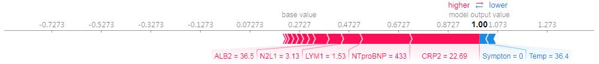

## Interpretable Machine Learning for COVID-19: An Empirical Study on Severity Prediction Task

> Understanding why black-box models make correct predictions, what they see in the pancemic.

https://arxiv.org/abs/2010.02006

### Introduction

In this research, we try to understand why those black-box models can make correct predictions. Is it possible to let black-box models speak, telling us how they make predictions? Will medical practitioners benefit from these models? 

Facing the sudden outbreak of COVID-19, it can be tough for humans to understand this new virus immediately, due to the surge of infected patients. However, machine learning models can be trained in minutes and then make correct predictions in the COVID-19 severity prediction task. But why and how?

### Understanding high-accuracy Black-box models

Instead of training a high-accuracy black-box model which may be difficult to trust, and deploy in medical applications, this research explores the possibility of using interpretable machine learning to unveil rationality under high-accuracy models.

Here are how different models make predictions about a severely infected patient.

#### Correct Predictions

**Neural networks** makes correct prediction, because it thinks the patient is old, and has a high CRP which indicates severe virus infection, and a high NTproBNP. 


**Gradient Boosted Trees** makes similar correct prediction, because it thinks the patient has a high CRP and NTproBNP, even though the patient shows little symptoms ( = 0).



#### Wrong Predictions

**Decision Trees** unfortunately makes a wrong prediction, because it thinks even though the patient is having a fever (38.4), but the CRP and NTproBNP is not high enough to be severe.


> The raw dataset comes from hospitals in China, including 92 patients contracted COVID-19.
> Our Research Ethics Committee waived written informed consent for this retrospective study that evaluated de-identified data and involved no potential risk to patients. All of the data of patients have been anonymized before analysis.


```
@misc{wu2020interpretable,
      title={Interpretable Machine Learning for COVID-19: An Empirical Study on Severity Prediction Task}, 
      author={Han Wu and Wenjie Ruan and Jiangtao Wang and Dingchang Zheng and Shaolin Li and Jian Chen and Kunwei Li and Xiangfei Chai and Sumi Helal},
      year={2020},
      eprint={2010.02006},
      archivePrefix={arXiv},
      primaryClass={cs.LG}
}
```

