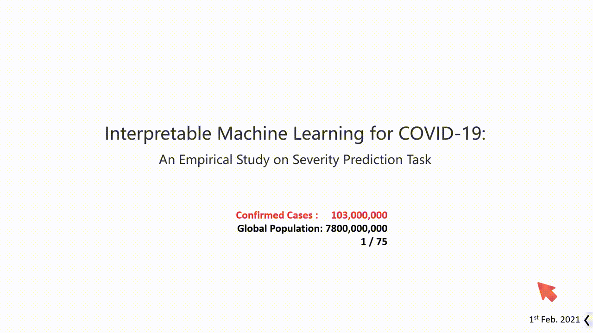
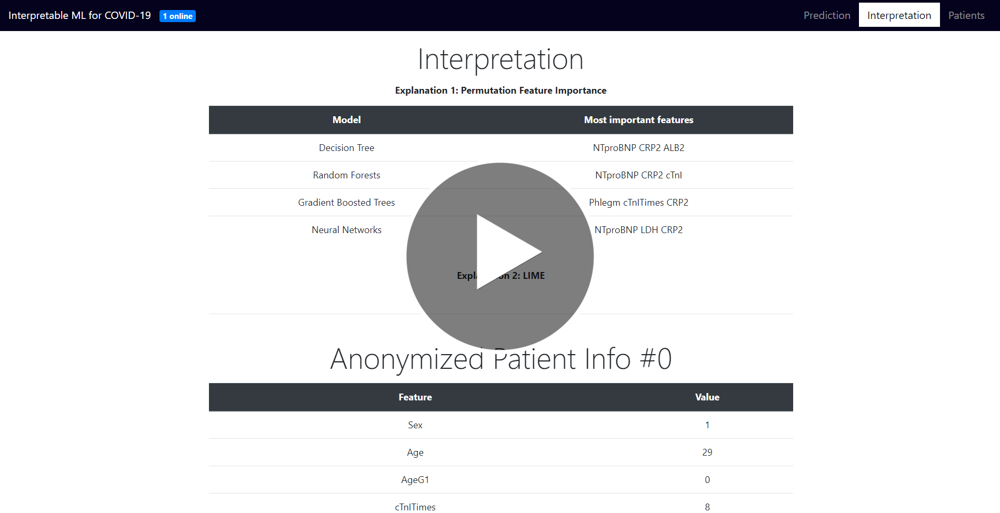
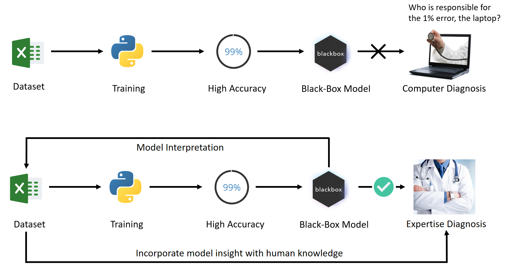
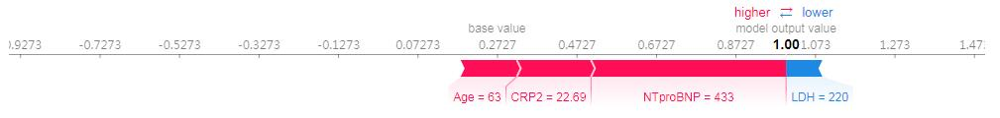
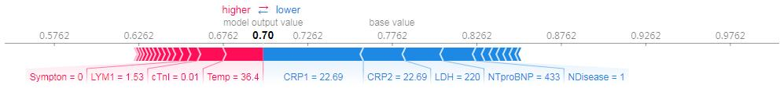

## Interpretable Machine Learning for COVID-19: An Empirical Study on Severity Prediction Task

> Understanding how black-box models make predictions, and what they see in the pandemic.

https://arxiv.org/abs/2010.02006



<a href="https://youtu.be/klOPynfwVmI"></a>

[Slides Available Here](https://github.com/wuhanstudio/interpretable-ml-covid-19/blob/master/Interpretable-ml-covid19.pdf)



### Introduction

The pandemic is a race against time. We seek to answer the question, how can medical practitioners employ machine learning to win the race in the pandemic?  

Instead of targeting at a high-accuracy black-box model that is difficult to trust and deploy, we use model interpretation that incorporates medical practitioners' prior knowledge to promptly reveal the most important indicators in early diagnosis, and thus win the race in the pandemic.  

### Understanding high-accuracy Black-box models

In this research, we try to understand why those black-box models can make correct predictions. Is it possible to let black-box models speak, telling us how they make predictions? Will medical practitioners benefit from these models?  

#### 【Correct Predictions】

**Neural networks** make a correct prediction because it thinks the patient is old and has a high CRP which indicates severe virus infection, and a high NTproBNP.  



**Gradient Boosted Trees** makes a similar correct prediction because it thinks the patient has a high CRP and NTproBNP, even though the patient shows little symptoms ( = 0).


#### 【Wrong Predictions】

**Decision Trees** unfortunately makes a wrong prediction, because it thinks even though the patient is having a fever (38.4), but the CRP and NTproBNP are not high enough to be severe.



### Credits

> The raw dataset comes from hospitals in China, including 92 patients who contracted COVID-19. Our Research Ethics Committee waived written informed consent for this retrospective study that evaluated de-identified data and involved no potential risk to patients. All of the data of patients have been anonymized before analysis.


```
@article{wu2021interpretable,
  title={Interpretable machine learning for covid-19: an empirical study on severity prediction task},
  author={Wu, Han and Ruan, Wenjie and Wang, Jiangtao and Zheng, Dingchang and Liu, Bei and Geng, Yayuan and Chai, Xiangfei and Chen, Jian and Li, Kunwei and Li, Shaolin and others},
  journal={IEEE Transactions on Artificial Intelligence},
  year={2021},
  publisher={IEEE}
}
```
